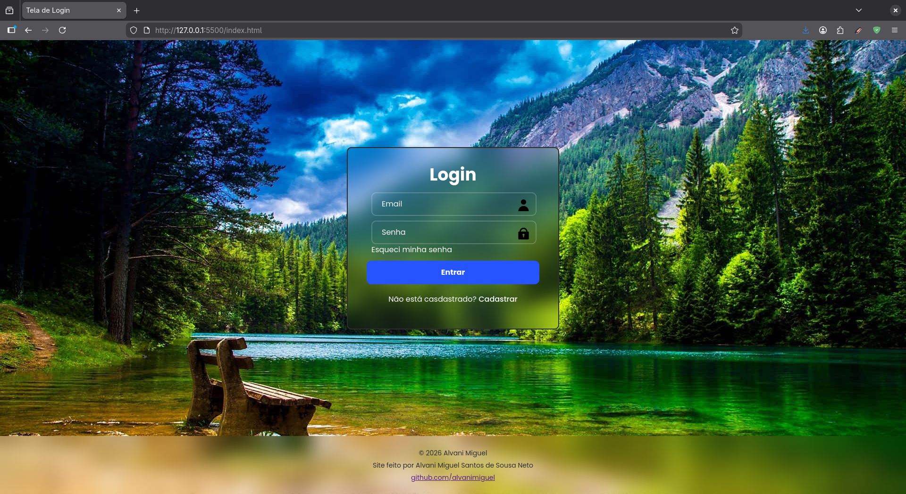

# 🔐 Tela de Login

Projeto simples de uma interface de login moderna, desenvolvida com HTML, CSS e JavaScript.

## 📸 Preview



> Interface com efeito blur, background personalizado e página com erro 404 personalizada.


## 🚀 Tecnologias utilizadas
- HTML5
- CSS3
- JavaScript
- Google Fonts (Poppins)

## 🎯 Objetivo do Projeto

Este projeto foi desenvolvido com o objetivo de estuda e praticar:

- Estruturação de páginas com HTML
- Estilização moderna com CSS
- Uso de Flexbox para layout
- Organização de arquivos

## 📂 Estrutura do Projeto

>login  
>├── 404.html  
>├── assets  
>│   ├── background.jpg  
>│   ├── lock2.svg  
>│   ├── lock.svg  
>│   ├── preview.png  
>│   └── user.svg  
>├── index.html  
>├── README.md  
>├── script.js  
>└── style.css  


## 💻 Como executar o projeto
1. Clone o repositório usando:
```bash
git clone https://github.com/alvanimiguel/login-page.git
```
2. Abra o arquivo `index.html` no navegador.

## 📌 Melhorias futuras

- Validação real de login
- Integração com backend
- Responsividade aprimorada
- Deploy online

## 👨‍💻 Autor

Desenvolvido por **Alvani Miguel**    
GitHub: https://github.com/alvanimiguel

## 📄 Licença

Este projeto foi desenvolvido com fins educacionais.    
É permitido utilizar, copiar, modificar e adaptar este código para estudos ou projetos próprios.